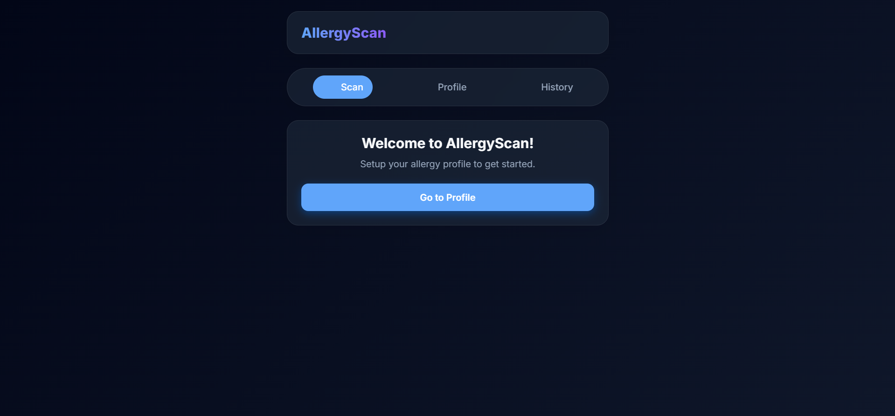
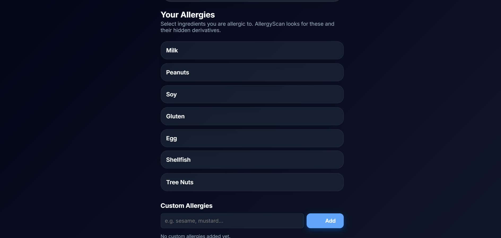
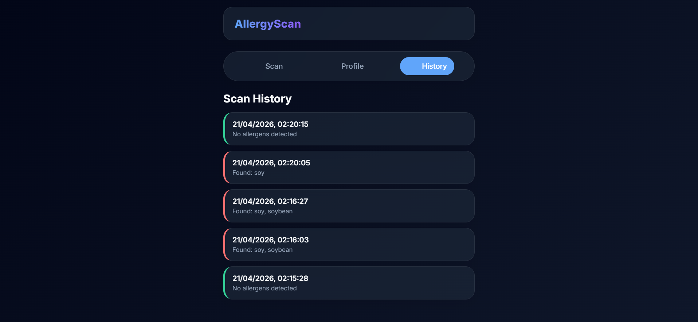

# 🧬 AllergyScan – Intelligent Ingredient Safety Auditor

A modern, privacy-focused web app that scans product ingredient labels and detects harmful allergens using OCR.

---

## 🚀 Features

* 📷 Scan ingredient labels using OCR
* 🧠 Detect hidden allergens (casein, albumin, etc.)
* 👤 Personalized allergy profile
* 🔊 Voice alerts for dangerous ingredients
* 📊 Local scan history
* 🌙 Clean glassmorphism UI with dark mode
* 🔒 Fully offline (runs in browser)

---

## ⚙️ Tech Stack

* React (CDN)
* Tesseract.js (OCR)
* Vanilla CSS (Glass UI)
* LocalStorage
* Python (for local server)

---

## 🖼️ Screenshots





---

## 🧠 Development Approach

This project was built using an **AI-assisted development workflow (vibe coding)**.

AI tools were used to:

* Generate initial structure
* Speed up development

Then the project was manually:

* Customized
* Improved in UI/UX
* Tested and refined

---

## 🛠️ Run Locally

```bash
python server.py
```

Open:

```
http://localhost:8000
```

---

## 🚀 Future Plans

* Barcode scanner
* Mobile app version
* AI-based ingredient understanding
* Cloud product database

---

## 👨‍💻 Author

Zamzan TP
